# UBank Digital — Mobile Banking UI/UX Prototype

UBank Digital is a Figma-based **mobile banking UI/UX prototype** focused on onboarding, authentication, dashboard, card management, transaction history, send money flow, and profile/settings.

> **Note:** This project is a UI/UX design prototype, not a production banking application. It does not include backend, real authentication, banking database, payment API, or production financial transactions.

---

## Preview

<p align="center">
  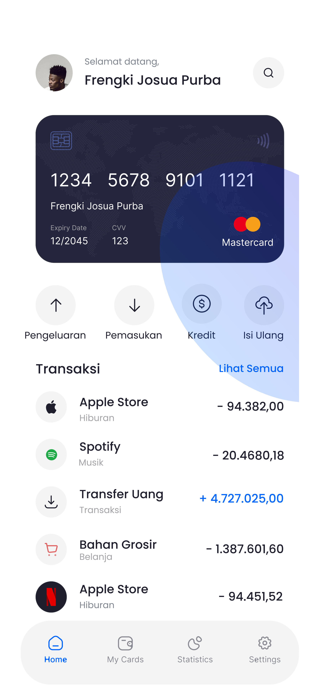
  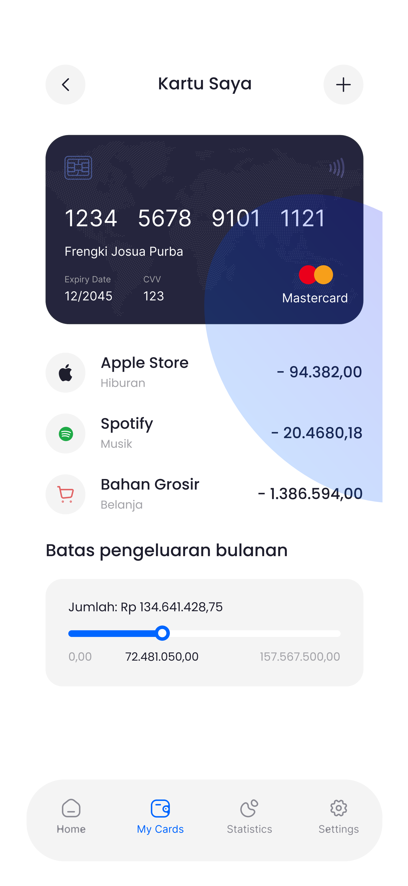
  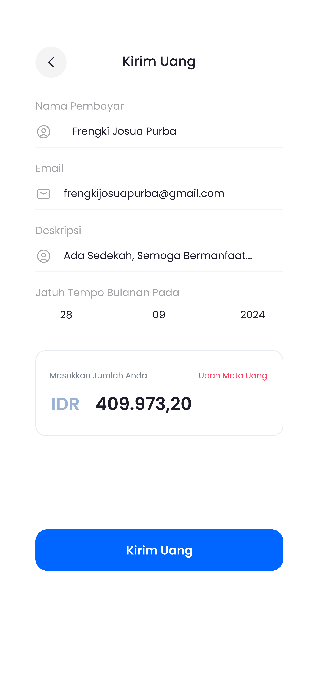
</p>

---

## Project Overview

UBank Digital explores a clean and simple mobile banking experience for individual users. The prototype covers the main flow of a digital banking app, starting from onboarding and authentication to dashboard overview, card management, transaction history, send money, and profile/settings.

The goal of this project is to demonstrate how a mobile banking product can be structured with clear navigation, simple financial information hierarchy, and a familiar mobile app interaction pattern.

---

## Role & Scope

**Role:** UI/UX Designer  
**Project Type:** Mobile Banking UI/UX Prototype  
**Platform:** Mobile App Design  
**Tool:** Figma  
**Deliverables:** Figma prototype, screen exports, video walkthrough, case study documentation

### Main Focus

- Onboarding flow
- Sign in and registration screens
- Home dashboard
- Card management
- Transaction history and search
- Send money flow
- Profile and settings
- Figma prototype walkthrough

---

## Prototype

Open the interactive Figma prototype:

https://www.figma.com/proto/lVhdA8v8ZryFdV85kppDs7/UBank-APP?node-id=1-2&t=6EAQY3SrkG1Z8THl-1&scaling=scale-down&page-id=0%3A1&starting-point-node-id=1%3A2

---

## Demo Video

A video walkthrough is available in this repository:

[`video-demo/ubank-prototype-demo.mp4`](video-demo/ubank-prototype-demo.mp4)

The video demonstrates the main prototype flow, including onboarding, authentication, dashboard, card management, transaction history, send money, and profile/settings.

---

## User Flow

```text
Splash / Logo
→ Onboarding
→ Sign In / Register
→ Home Dashboard
→ Statistics
→ My Cards
→ Transaction History
→ Search Transaction
→ Send Money
→ Profile / Settings
```

---

## Key Screens & Explanation

### 1. Onboarding — Payment Introduction

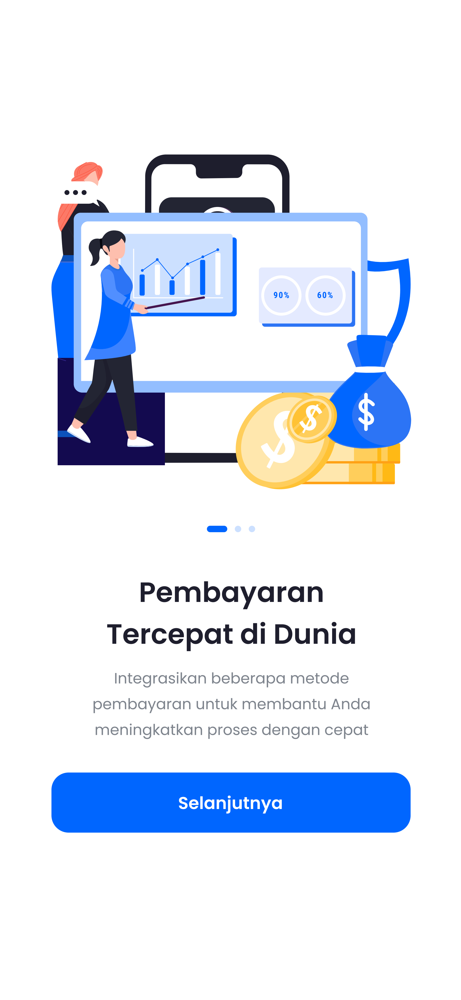

This screen introduces the product value proposition. It is used to communicate that UBank Digital helps users make financial activities feel faster and easier through a mobile experience.

---

### 2. Onboarding — Security Message

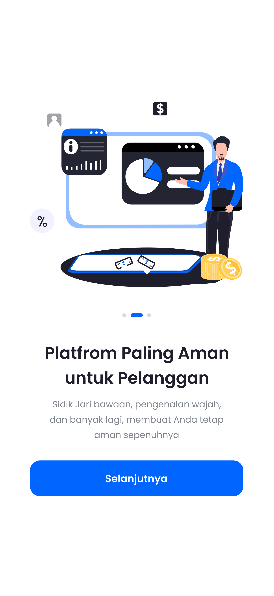

This onboarding screen focuses on the security perception of the product. For a banking-related interface, building user trust early is important before users continue to authentication.

---

### 3. Sign In

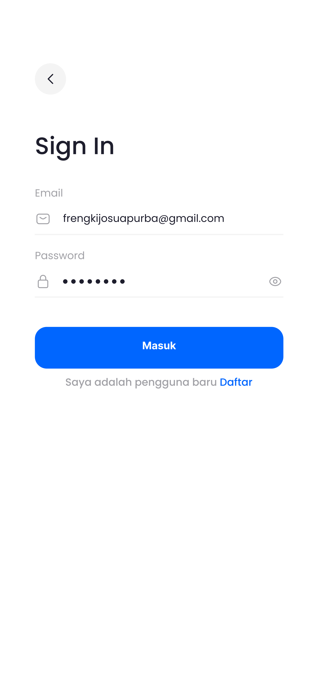

The sign in screen provides a simple authentication entry point. The layout is designed to be familiar, with clear input fields and a primary call-to-action button.

---

### 4. Register

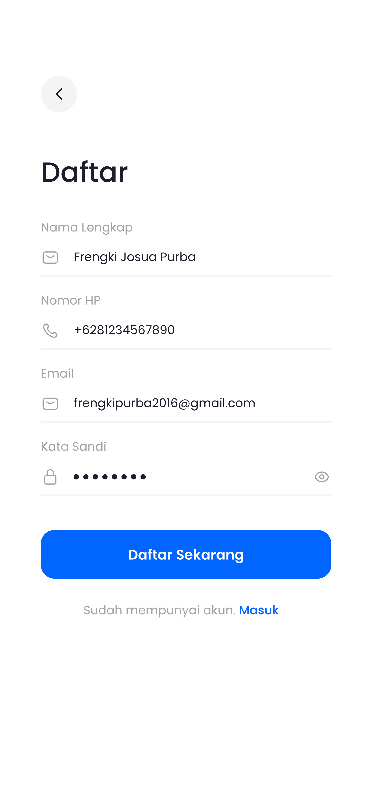

The registration screen supports new users who do not have an account yet. It keeps the form structure simple so the user can understand the required information quickly.

---

### 5. Home Dashboard


The dashboard acts as the main hub of the app. It presents the user's card overview, financial summary, quick actions, and recent transaction access in one place.

---

### 6. Statistics

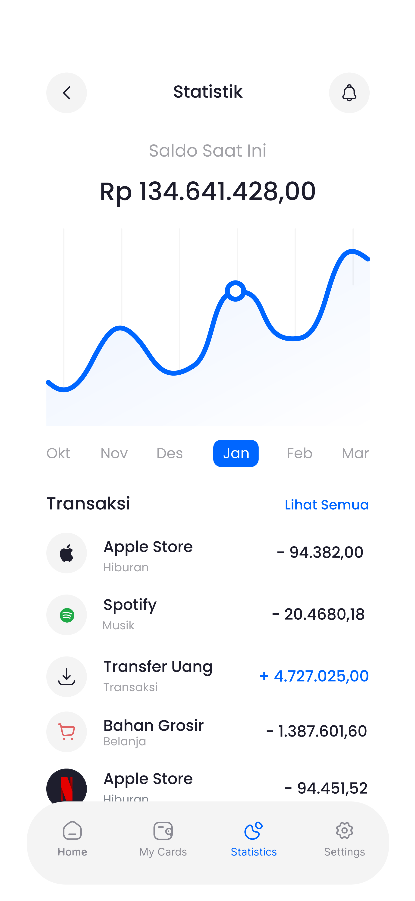

The statistics screen helps users understand financial activity visually. It supports the user in reviewing spending or transaction patterns through a more visual overview.

---

### 7. My Cards


The card management screen shows the user's card information and related card actions. This screen represents one of the core mobile banking features in the prototype.

---

### 8. Transaction History

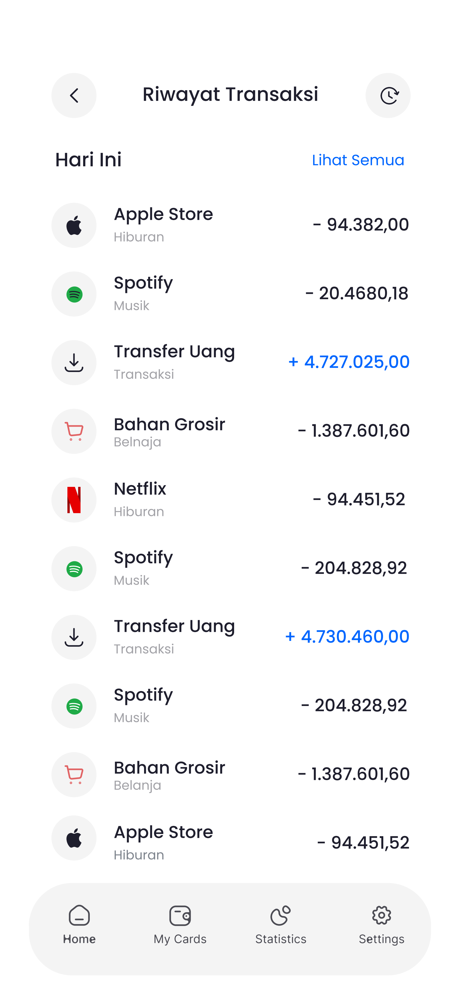

The transaction history screen allows users to review previous financial activities. The list-based layout helps users scan merchants, categories, dates, and transaction amounts.

---

### 9. Search Transaction

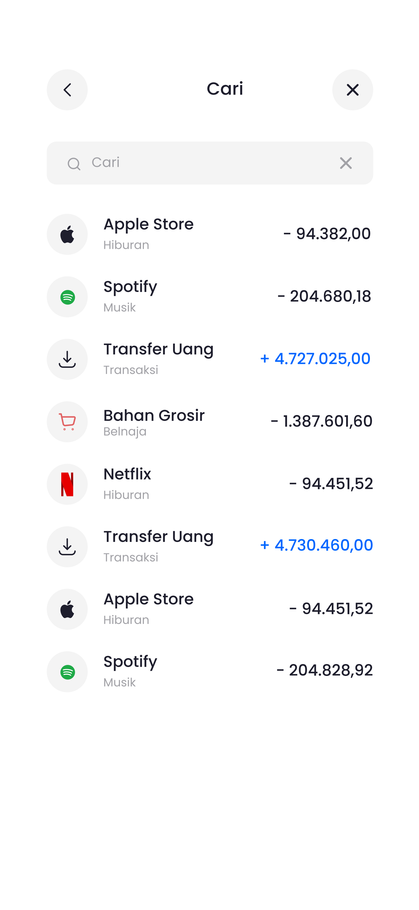

The search transaction screen supports faster access to specific transactions. This is useful when users need to find a past payment, transfer, or spending activity.

---

### 10. Send Money


The send money screen demonstrates a transfer flow where users select a recipient and input the transfer amount. This flow is one of the most important interactions in a banking app.

---

### 11. Profile & Settings

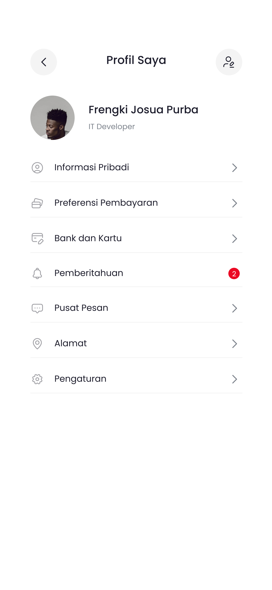

The profile and settings screen gives users access to account-related controls, preferences, and personal information management.

---

## Design System Summary

The visual direction uses a clean mobile banking interface with:

- Blue as the primary action color
- White background for clarity
- Card-based layout for financial information
- Bottom navigation for main sections
- Rounded components and clean spacing
- Form input patterns for authentication and profile flows
- Transaction lists with icons and amount hierarchy

---

## Repository Structure

```text
ubank-digital-figma-case-study/
├─ README.md
├─ screenshots/
│  ├─ 01-onboarding-payment.png
│  ├─ 02-onboarding-security.png
│  ├─ 03-sign-in.png
│  ├─ 04-register.png
│  ├─ 05-home-dashboard.png
│  ├─ 06-statistics.png
│  ├─ 07-my-cards.png
│  ├─ 08-transaction-history.png
│  ├─ 09-search-transaction.png
│  ├─ 10-send-money.png
│  └─ 11-profile-settings.png
└─ video-demo/
   └─ ubank-prototype-demo.mp4
```

---

## Security & Privacy Notes

Because this is a banking-related UI/UX prototype, all visible data should be treated as dummy content. Before publishing screenshots or video publicly, make sure that:

- Card numbers are masked
- CVV values are hidden
- Phone numbers and emails are dummy or masked
- No real personal data is shown
- No real banking credentials or private account information is included

---

## Notes

This repository is intended for portfolio documentation only. It does not contain production banking logic, backend services, real authentication, database migrations, financial APIs, or live payment functionality.
